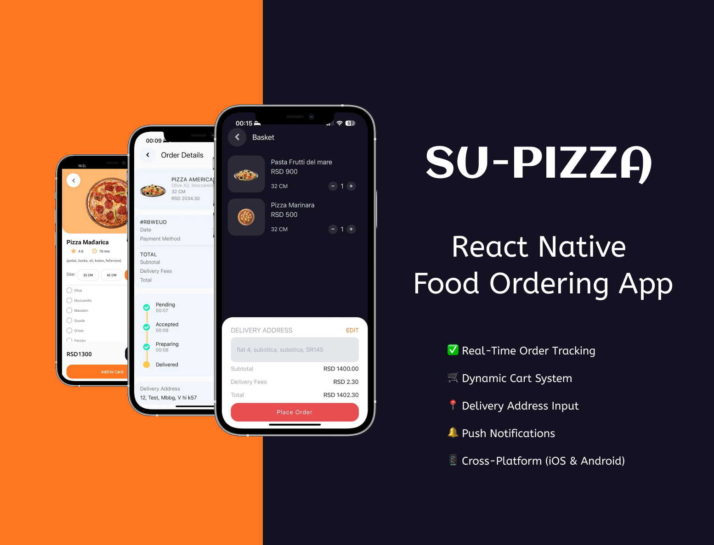
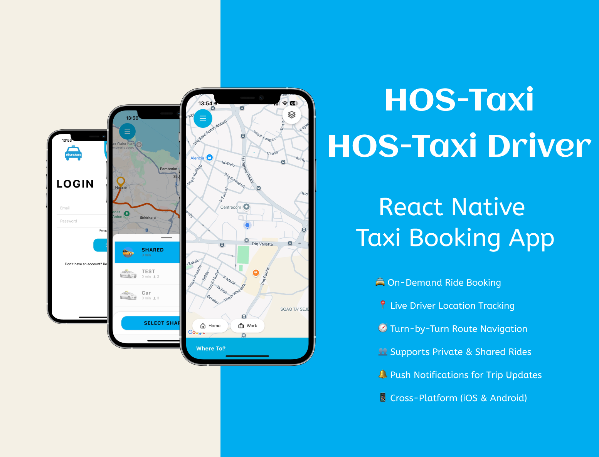
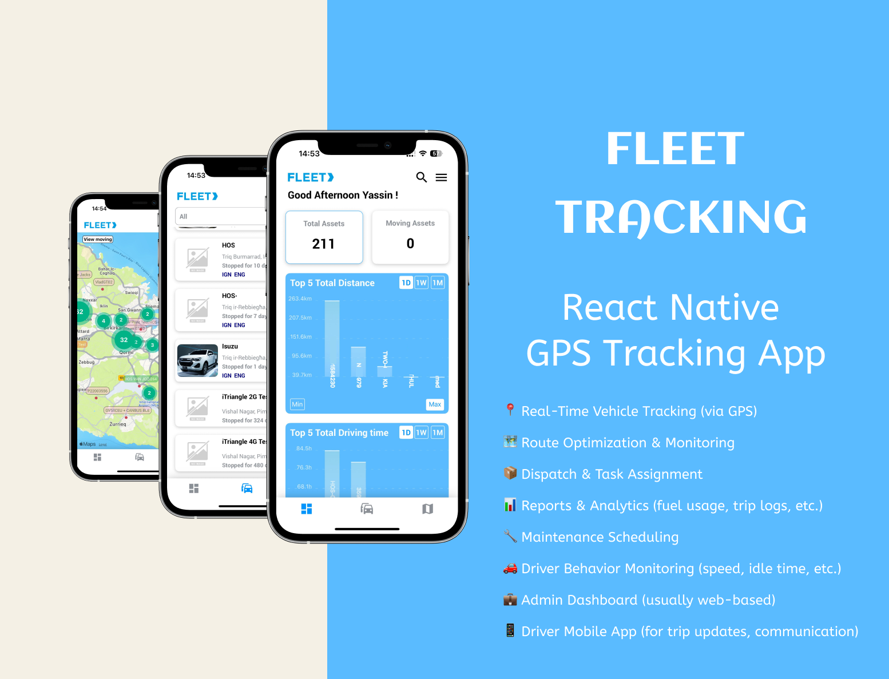

# Hi, I'm Yassin Hkiri 👋

### Senior Full-Stack Developer
**React · TypeScript · Node.js · Go · Java/Spring Boot · PostgreSQL · Cloud**

📍 Malta · Open to worldwide remote opportunities

---

## About Me

I'm a **Senior Full-Stack Developer with 8+ years of experience** building and modernizing production full-stack web and backend systems across **FinTech, IoT, e-commerce, transportation and payments/POS**.

I work across **React/TypeScript** frontends, **Go, Node.js and Java/Spring Boot** backend services, and **PostgreSQL, TimescaleDB, MySQL and MongoDB** data layers.

My recent work includes transaction-monitoring platforms processing **100K to 1M+ transactions per day**, database modernization, performance optimization, CI/CD and production support across multiple client environments.

I enjoy owning features end to end: architecture and implementation, code review, deployment, production troubleshooting and continuous improvement in distributed teams.

---

## Highlights

- ⚡ Optimized database queries from **12–20 seconds to 500–700 ms** on high-volume deployments
- 🔄 Worked on major migrations: **MySQL → PostgreSQL**, **InfluxDB → TimescaleDB**, **Redux → Redux Toolkit**
- 📦 Delivered **10+ production web and mobile applications**
- 💳 Integrated **Stripe and eMerchantPay** payment gateways
- 📱 Supported POS systems processing **1,000+ transactions/day** at approximately **98% success rate** across **200+ devices**
- 👥 Led code reviews and mentored **2 junior developers and 3 interns**

---

## Tech Stack

| Area | Technologies |
|---|---|
| **Frontend** | React.js, TypeScript, JavaScript, Redux Toolkit, React Hooks, Material UI, Ant Design |
| **Backend** | Go, Node.js, Java, Spring Boot, REST APIs, Spring Security, JWT, OAuth2, Hibernate/JPA |
| **Data** | PostgreSQL, TimescaleDB, MySQL, MongoDB, InfluxDB, SQLite |
| **Cloud & DevOps** | Microsoft Azure, AWS, Docker, Jenkins, CI/CD, Git, GitHub, Bitbucket |
| **Mobile** | React Native, Android, Kotlin, Java |
| **Practices** | Clean Architecture, SOLID, design patterns, legacy modernization, code review, Agile/Scrum |

---

## Selected Experience & Projects

> Most of my professional work is proprietary and lives in private company repositories. The projects below describe the products, architecture and technologies I have worked with without exposing private source code.

### 🛡️ ComplyRadar — FinTech / AML Transaction Monitoring

Transaction-monitoring platform used by banking and iGaming clients.

- Full-stack development across **React.js** and **Go/Java** backend services
- Client deployments processing **100K to 1M+ transactions per day**
- Database modernization from **MySQL to PostgreSQL**
- Time-series migration from **InfluxDB to TimescaleDB**
- Query optimization from **12–20 s to 500–700 ms**
- Deployment and CI/CD with **Azure, Docker and Jenkins**

**Stack:** React · Redux Toolkit · Go · Java · PostgreSQL · TimescaleDB · Azure · Docker · Jenkins

---

### 🌱 BioAqua — IoT / Agriculture

A scalable IoT monitoring platform that collects farm sensor data, analyzes it and triggers automated actions or notifications from user-defined rules.

- Sensor-data ingestion and monitoring
- Rule-based automation and alerts
- Web dashboard for monitoring and control

**Stack:** React.js · Node.js · MongoDB · AWS

---

### 🍕 Su-Pizza — Food Ordering & Delivery

A multi-platform ordering and delivery system with a customer website, admin portal and mobile applications.

- Product catalog and customizable items
- Cart, checkout and payment flows
- Order tracking and delivery workflows
- Administration tools for menus, orders and deliveries

**Stack:** React.js · React Native · Redux Toolkit · Node.js · MongoDB · AWS

---

### 🚕 HandsOn Taxi — Transportation Platform

A transportation platform supporting private and shared taxi services across web and mobile applications.

- REST APIs connecting web and mobile clients to **Spring Boot** services
- Geolocation, routing and real-time pricing
- **Stripe and eMerchantPay** payment integrations
- Rider and driver workflows across React and React Native applications

**Stack:** React.js · React Native · TypeScript · Spring Boot · Google Maps API · Firebase

---

### 🚚 Fleet Tracking

Real-time vehicle tracking and monitoring with location updates, map-based views and movement notifications.

**Stack:** React Native · TypeScript · Google Maps API · Firebase · REST APIs · Redux

---

## Earlier Mobile & Payments Experience

- **NCR Pay:** Android POS/payment application using Kotlin and Java, supporting card and mobile-wallet workflows
- **RFID Asset Management:** Android application for RFID-based asset tracking, GPS tagging and offline synchronization
- **Task Master:** Offline-first workforce application with role-based access and synchronization

---

## Current Focus

I'm focused on **senior full-stack opportunities** involving modern web platforms, backend services, APIs, data-intensive systems and cloud deployments — especially in **FinTech, IoT, logistics, transportation and SaaS**.
